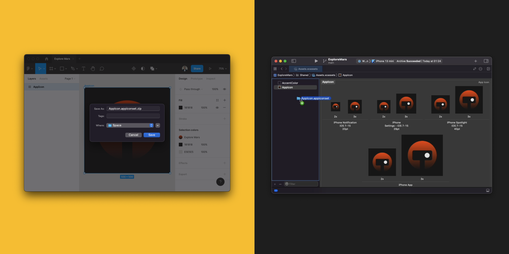

# Xcode App Icon Export _for Figma_

This plugin automatically generates a zipped AppIcon.appiconset container from a selected frame in Figma, and it contains all the PNGs for all apple platforms.
The folder is pre-formatted so you just need to drop the unzipped folder in your Assets.xcassets.
 
 

## Usage

1. Select a frame containing your app icon.
1. Press command + / and search for Xcode App Icon Exporter.
1. Run the plugin.
1. Save and unzip the AppIcon.appiconset.zip file.
1. Drag and drop the new AppIcon.appiconset in Xcode's Assets.xcassets.
1. And Voilà 🪄

## Todo

- [ ] UI to select platforms (macos, watchos, carplay, etc...)
- [ ] Gamut selection

## Author

- Ali Karagoz (@alikaragoz)
